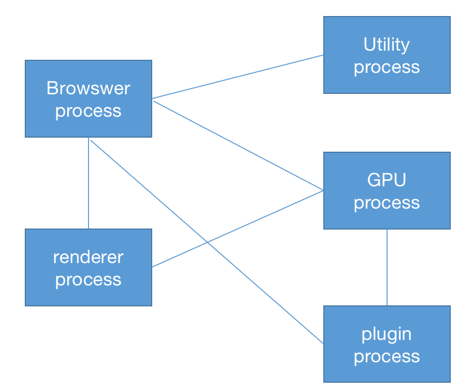

#### 第五章 性能优化指南

性能优化是前端开发里非常重要的一部分。为了实现资源的快速加载，各个前端开发团队都是使用浑身解数争取更好的用户体验。本章我们着重从浏览器运行机制出发，介绍浏览器缓存相关机制，让大家明白各个优化点的背后的原理，形成系统的知识点。

由于大部分的主流浏览器都向webkit靠拢，Edge已由webkit开发并已发布稳定版本，之前的IE6到IE11版本都是Trident内核。Firefox浏览器使用的是Gecko内核。Safari也是有最初的webkit内核升级到了webkit2。Opera也追随到到了webkit阵营，抛弃了Presto，于2013年4月采用Google发布的Blink内容(Blink是是Google在webkit基础上为了分离组件而建立的新的分支)。所以还是以webkit作为主线进行介绍。

本章包含如下内容：

1、浏览器的运行机制

2、浏览器的缓存机制

3、性能分析涉及各模块解释

4、从具体细节出发介绍优化策略

##### 5.1 浏览器运行机制

浏览器背后的运行机制非常负责，是由多个进程协作完成。  为了更好的说明浏览器的运行机制，我们从一道经典的面试题开始：

从地址栏输入URL到页面加载完成，中间都经历了什么？

正式介绍前，我们需要先看下Chrome的多进程架构，有助于更形象地说明这个过程

> 关于进程和线程的wikipedia解释：用户下达运行程序的命令后，就会产生进程。同一程序可产生多个进程（一对多关系），以允许同时有多位用户运行同一程序，却不会相冲突。
> 
> 进程需要一些资源才能完成工作，如[CPU](https://zh.wikipedia.org/wiki/CPU "CPU")使用时间、[存储器](https://zh.wikipedia.org/wiki/%E8%A8%98%E6%86%B6%E9%AB%94 "存储器")、文件以及[I/O](https://zh.wikipedia.org/wiki/I/O "I/O")设备，且为依序逐一进行，也就是每个CPU核心任何时间内仅能运行一项进程。
> 
> 进程与线程的区别：进程是计算机管理运行程序的一种方式，一个进程下可包含一个或者多个线程。线程可以理解为子进程。一个进程可以有很多线程，每条线程并行执行不同的任务，并且同一进程中的多条线程将共享该进程中的全部系统资源。

Chrome是多进程的，两个进程之间可以通过IPC(Inter Process Communication)的方式进行通信，顶层由一个Browser process用来协调浏览器的其他进程。

具体来说，Chrome的主要进程及其职责如下：

Browser Process：负责包括地址栏，书签栏，前进后退按钮等的工作；负责处理浏览器的一些不可见的底层操作，比如网络请求和文件访问。

Renderer Process：主要负责一个 tab 内关于网页渲染的所有事情。

Plugin Process：控制一个网页用到的所有插件，比如说逐渐被淘汰的flash。

GPU Process：处理 GPU 相关的任务。

从上面各个进程的职责上来看，Browser Process主要协调Tab之外的主要工作，它并且又对这些工作进行了更细粒度的划分，使用不同的线程进行处理：

- UI 线程 ： 控制浏览器上的按钮及输入框。
- network 线程: 处理网络请求，从网上获取数据。
- storage 线程: 控制文件等的访问；

 现在，我们回到上面那个面试题。当在地址栏中输入网址敲回车键后到看到整个页面大概分成这几步。

**处理用户输入**

先由UI线程判断用户输入的是一个网址还是一个要查询的关键字。因为Chrome中地址栏同时也是一个输入框。UI线程去解析内容并判断是需要把输入的内容交给查询引擎呢还是要导航到你需要的网站。

**开始导航**

敲击回车键，UI 线程 通知 network 线程 获取网页内容，并控制 tab 上的 spinner 展现，表示正在努力加载中。

network 线程 会执行 DNS 查询，随后为请求建立 TLS 连接。

> DNS(运行在UDP协议上)是互联网上域名和IP地址相互映射的分布式数据库，有了DNS，用户不用在记住每个域名的IP地址就可以上网。比如当在地址栏输入http://developer.mozilla.org ，DNS服务器就可以解析该主机名得到IP地址，该过程就叫做域名解析。
>
> 主机到IP地址的映射一般是两种方式：静态映射和动态映射。区别在于：静态映射方式是每台设备上分别配置映射关系，各自维护各自的，只能独享；动态映射是建立一套DNS系统，只需要在该系统上配置映射关系，各域名解析都用这套系统，达到共享的目的。

如果 network 线程 接收到了301重定向请求头 ，那么network线程会通知UI线程 "服务器要求重定向"，随后，另外一个 URL 请求会被触发。

**读取响应体**

一旦服务器返回内容，network 线程会读取响应主体中的MIME类型信息，"Content-Type"字段说明返回内容的格式，"Content-Length"描述响应主体的内容长度。

一旦MIME的类型信息描述为"test/html"，该类型表示为网页信息。下一步将会把这些数据传递给 renderer process，如果是 压缩文件或者其它文件，会把相关数据传输给下载管理器。

[Safe Browsing](https://link.zhihu.com/?target=https%3A//safebrowsing.google.com/) 检查也会在此时触发，如果域名或者请求内容匹配到已知的恶意站点，network线程会展示一个警告页。此外 [CORB](https://link.zhihu.com/?target=https%3A//www.chromium.org/Home/chromium-security/corb-for-developers) 检测也会触发,确保敏感数据不会被传递给渲染进程。

> Safe Browsing: https://safebrowsing.google.com/
>
> CORB:  https://www.chromium.org/Home/chromium-security/corb-for-developers

**查找渲染进程（renderer process）**

 当上述所有检查完成，并且通过安全检查，network 线程确信浏览器可以导航到请求的页面，network 线程就会通知 UI 线程数据已经就绪，这时UI 线程会查找到一个renderer process 进行网页渲染。其实，为了能快速响应，UI线程会预查找和启动一个渲染线程，如果可以访问，该渲染进程继续。如果有重定向，准备好的线程就会废弃而重启一个线程。

**确认导航**

经过上面的步骤，数据已就绪，渲染线程也已经创建，可以说是万事俱备只欠东风了，这个东风是什么呢？就是前面咱们提到的进程间的通信，IPC消息。Browser Process 会给 renderer process 发送 IPC 消息来确认导航，一旦 Browser Process 收到 renderer process 的渲染确认回复，导航过程结束，页面加载过程开始。

此时，地址栏已更新为新网址，呈现出新网页内容。history tab同样会更新，此刻可通过返回键返回到原来的页面。为了让tab页签 或者窗口关闭后能够恢复，这些信息都会保存到硬盘中。

**额外的操作**

一旦导航被确认，renderer process 会加载资源并渲染页面，渲染流程是怎么工作的，这里先不展开了，后面我们将重点介绍渲染流程。当 renderer process 渲染完所有的页面，并且触发了所有帧的onload事件，会到 Browser process发送 IPC 信号， UI 线程停止展示 tab 中的 spinner。

当输入另一个URL加载新页面的时候，上面的加载流程当然会重新执行，当出现新的导航请求时，Browser Process 需要通知 renderer Process 进行相关的检查，对相关事件进行处理，毕竟所以代码的执行都是有renderer process来完成的。

如果通过js代码(window.location="http://xxx.com")导航到新站点的时候,renderer process会首先检查beforeunload事件，导航请求由 renderer process 传递给 Browser process。

> Google官网关于页面生命周期的帖子：https://developers.google.com/web/updates/2018/07/page-lifecycle-api

**关于service worker**

有些页面注册有 Service Worker，可以通过该方案实现网络代理，让开发者对本地缓存及判断何时从网络上获取信息有了更多的控制权，如果 Service Worker 设置为从本地 cache 中拿数据，那就没必要从网上从新请求了。

值得注意的是 service worker 也是运行在renderer process中的代码，但是上述流程有少许的不同。

当有 Service Worker 被注册时，其作用域会被保存，当有导航时，network线程会在注册过的 Service Worker 的作用域中查找相关域名，如果存在对应的存在，UI线程会查找一个renderer process来处理相关代码，Service Worker 可能会从 cache 中加载数据，终止对网络的请求，也可能从网上请求新的数据。 

##### 5.2 浏览器缓存机制

##### 5.3 性能分析各模块解释

##### 5.3 前端优化策略

5.3.1 图片优化和DOM优化建议

5.3.2 JavaScript优化建议

5.3.3 webpack优化

5.3.4  http2.0

5.3.5 websocket
